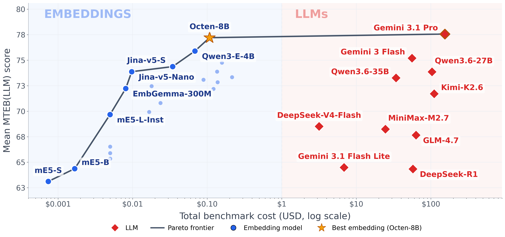

# The Embedder's Dilemma: LLMs Are Better, but at What Cost?

Code, data, and results for the COLM 2026 paper. **MTEB(LLM)** compares two ways of solving
text-similarity tasks — an embedding pipeline vs. prompting an LLM directly — on identical data,
with exact cost and throughput accounting.

- **10 LLMs** (6 families) and **26 embedding models**, evaluated on **37 tasks** across five MTEB
  categories: Classification (8), Clustering (9), STS (10), PairClassification (4), Retrieval (6).
- The two paradigms tie on aggregate performance: LLMs lead on reasoning-heavy retrieval, embeddings on
  classification; but embeddings are orders of magnitude cheaper.



## Repository layout

```
llm_judge/            LLM evaluation framework (built on mteb 2.6.5)
  tasks/              37 MTEB(LLM) task classes, each pinning its HF dataset revision
  evaluators/         per-category evaluators (classification, STS, clustering, retrieval, ...)
  llm_client.py       async OpenAI-compatible client with schema validation + usage tracking
  llm_reranker.py     LLM listwise reranker for the BRIGHT/BEIR pipeline
scripts/
  aggregate_scores.py raw result JSONs -> data/scores.csv
  generate_tables.py  every LaTeX table in the paper
  verify_numbers.py   checks every number quoted in the paper's prose against the data
  experiments/        runners: ablations, few-shot, BRIGHT/BEIR retrieve-then-rerank pipeline
  plotting/           every figure in the paper (registry.py is the single source of truth)
  data_prep/          construction of the mteb/llm-eval-* datasets
data/                 consolidated CSVs (scores, costs, token counts, throughput)
llm_results/          raw per-task result JSONs + prediction samples for each LLM
embedding_results/    raw per-task result JSONs for each embedding model
ablation_results/     thinking-budget ablations (off / low)
pipeline_results/     BRIGHT + BEIR first-stage / rerank pipeline results
visualizations/       all paper figures (PNG + PDF)
```

## Datasets and models

- [DATASETS.md](DATASETS.md) — the 37 tasks with their Hugging Face datasets
  (`mteb/llm-eval-*`) and pinned revisions.
- [MODELS.md](MODELS.md) — all evaluated models with overall scores and total evaluation cost.

Both paradigms see identical data: embedding models embed the same held-out subsets
(seed = 42) that the LLMs read.

## Reproducing the paper

Everything in the paper regenerates from the raw result files in this repository —
no API keys or GPUs needed:

```bash
uv sync --group analysis

uv run python scripts/aggregate_scores.py         # rebuild data/scores.csv from raw JSONs
uv run python scripts/generate_tables.py          # all LaTeX tables
uv run python scripts/verify_numbers.py           # check paper numbers against the data
uv run python scripts/plotting/plot_pareto.py     # Figure 1 (and so on for each figure)
```

| Paper item | Script |
|---|---|
| Cost vs. performance Pareto (Figure 1) | `plotting/plot_pareto.py` |
| Per-category Pareto | `plotting/plot_pareto_per_category.py` |
| Retrieve-then-rerank on BRIGHT/BEIR | `plotting/plot_reranker.py` |
| Thinking-token tax | `plotting/plot_thinking_tax.py` |
| Architecture schematic | `plotting/plot_architecture.py` |
| Throughput comparison | `plotting/plot_throughput_h100.py` |
| Appendix figures (leaderboards, radar, heatmap, task ranges) | `plotting/plot_category_leaderboards.py`, `plot_radar.py`, `plot_task_heatmap.py`, `plot_task_delta.py` |
| All tables | `generate_tables.py` |

## Evaluating a new LLM

Point `.env` at any OpenAI-compatible endpoint and run the suite:

```bash
cp .env.example .env      # set BASE_URL, TOKEN, MODEL
uv sync

uv run python scripts/smoke_test_llm.py    # endpoint sanity check
uv run python -m llm_judge.main            # full 37-task evaluation
uv run python scripts/aggregate_scores.py  # fold the new results into scores.csv
```

Thinking-budget controls (`REASONING_EFFORT`, `ENABLE_THINKING`, `MAX_CONCURRENCY`, ...) are
documented in `llm_judge/settings.py`. Results are written to `llm_results/<model>/` in
standard mteb format, so embedding models evaluated with vanilla
[mteb](https://github.com/embeddings-benchmark/mteb) on the same tasks are directly comparable.

Note: `LLMRTE3PC` (pair classification) requires `mteb>=2.11` for its multilingual config and was
run separately; the other 36 tasks run under the pinned `mteb==2.6.5`.

## Retrieve-then-rerank pipeline (BRIGHT + BEIR)

The Section 6 pipeline — 4 first-stage retrievers x {none, cross-encoder, LLM listwise} rerankers
on BRIGHT-7 and BEIR-5 — lives in `scripts/experiments/run_pipeline.py`
(see `run_llm_sweep.sh` for the full sweep). Cached results ship in `pipeline_results/`;
`scripts/experiments/aggregate_rerank_matrix.py` rebuilds the paper's reranker matrix from them.

## Citation

```bibtex
@inproceedings{elassadi2026embedders,
  title     = {The Embedder's Dilemma: {LLM}s Are Better, but at What Cost?},
  author    = {El Assadi, Adnan and Muennighoff, Niklas and Lee, Jinhyuk},
  booktitle = {Conference on Language Modeling (COLM)},
  year      = {2026},
}
```
